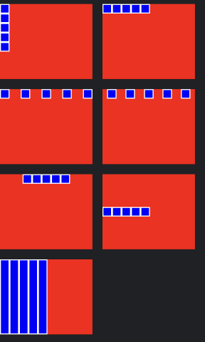

# ti.flexbox - Flexbox layout for Titanium



using https://github.com/google/flexbox-layout

## Example

```js
const TiFlexbox = require('ti.flexbox');
const flexView = TiFlexbox.createFlexView({
	direction: "row",
	justifyContent: "spaceAround"
});
````

## Parameters
* <b>direction</b>: row, rowReverse, column, columnReverse,
* <b>alignItems</b>: stretch, baseline, center, flexEnd, flexStart
* <b>alignContent</b>: spaceBetween, spaceAround, center, flexEnd, flexEnd
* <b>justifyContent</b>: spaceBetween, spaceEvenly, spaceAround, center, flexEnd, flexStart
* <b>wrap</b>: wrap, noWrap
